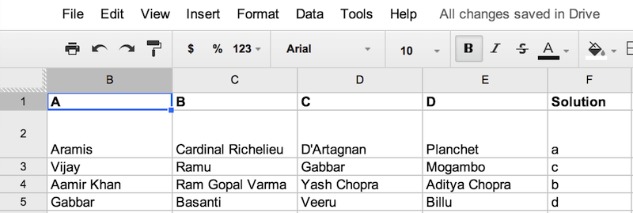

# Quizlet

RESTful API for fetching random multiple choice quiz questions from a Google Spreadsheet using node.js and express.

Here's the format the spreadsheet needs to be in.

Grab the key of the google spreadsheet, and pass it as an environment variable or a config parameter (if you are using heroku).

<pre>
GOOGLE_SPREADSHEET_KEY=INSERT_YOUR_KEY foreman start
</pre>